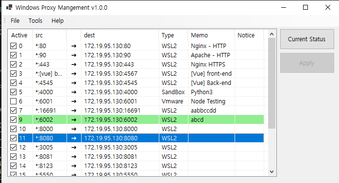

# windows proxy management

## Purpose
Executable to easily configure proxy in Windows

See the [Wiki](https://github.com/somersby10ml/windows-proxy-management/wiki) for usage.

## Notice
- Use `netsh.exe`
- It's ok to read but requires admin privileges to set it up.

## Feature
- easy proxy settings
- A note about proxies
- <del>Automatic WSL Settings</del>

## Support
- WSL2
- Windows Sandbox
- Vmware

## Build
Visual Studio 2022 C# (.NET 6.0)

## Todo
- [ ] Run the service (the UAC window does not appear)
